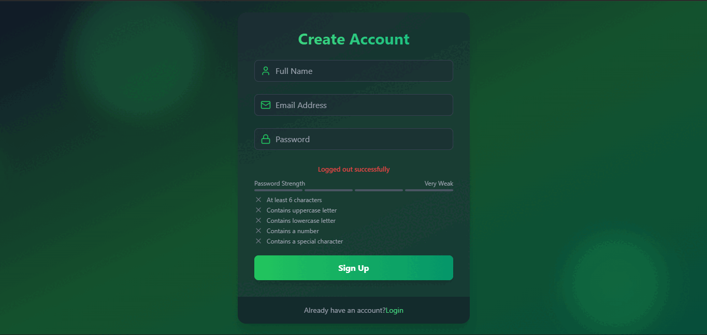
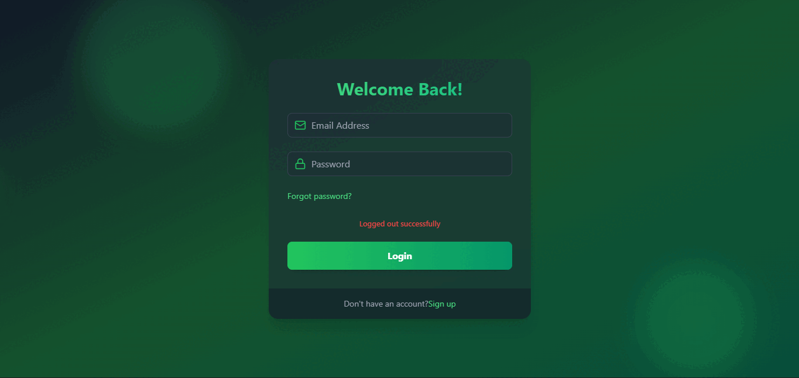
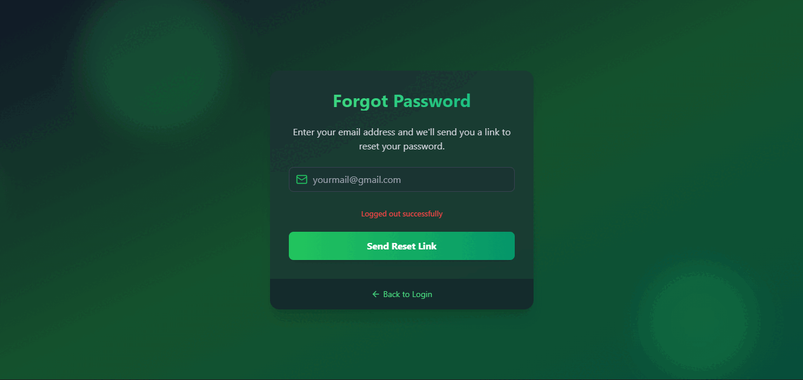
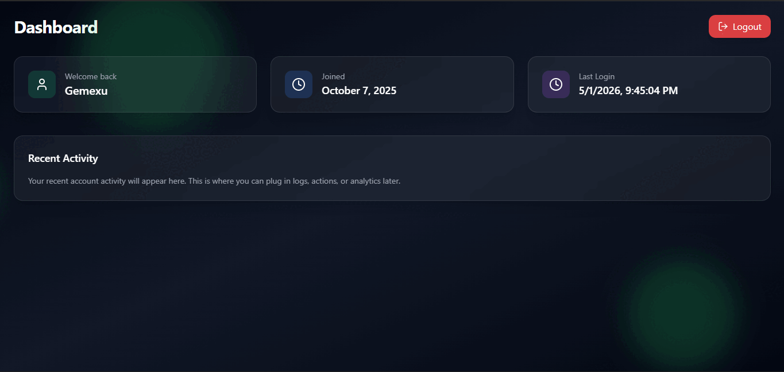
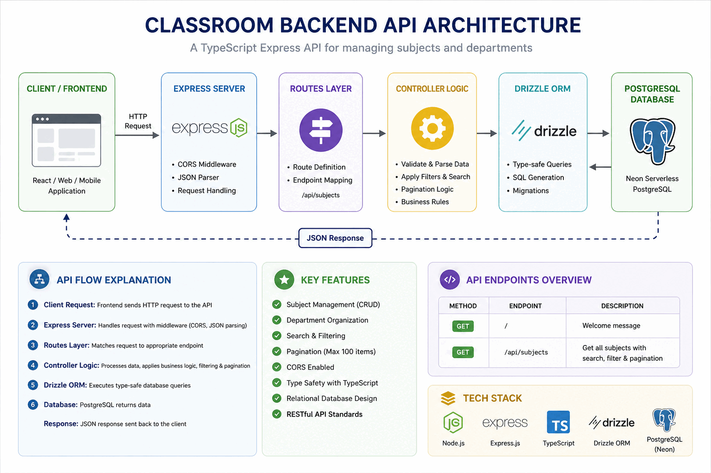
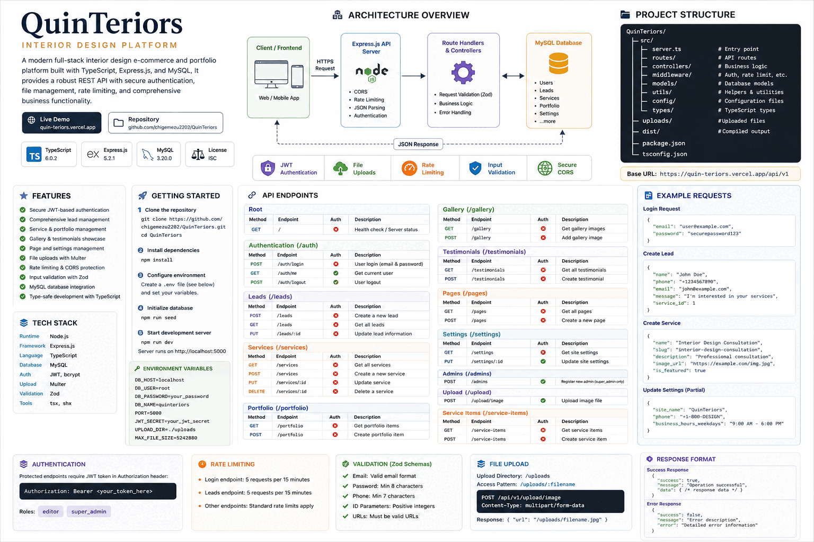

<!-- ================= HEADER ================= -->
<h1 align="center">Hi 👋, I'm Chigemezu Ezimoha</h1>
<h3 align="center">
Full-Stack Engineer building scalable backend systems, authentication platforms, and data-driven applications
</h3>

  
  
  

---

<!-- ================= STATS ================= -->

  
  

---

## 🧠 About Me
- 💻 Full-stack engineer specializing in **React, Next.js, Node.js, and Laravel**
- 🔐 Built **production-style authentication systems** (email verification, password recovery, secure APIs)
- 🏗️ Focused on **scalable architecture, performance, and clean backend design**
- 📊 Expanding into **Data Engineering & AI systems**
- 🌍 Passionate about building **real-world, impactful software systems**

---

## 🧠 What I Build
- 🔐 Authentication & security systems  
- 📊 Dashboard & admin platforms  
- ⚙️ API-driven backend architectures  
- 🏗️ Scalable full-stack applications  

---

## 🚀 Featured Projects

### 🔐 Authentication System
Full-stack authentication platform with secure API design, email verification, password reset flow, and protected routes.

🔗 https://github.com/chigemezu2202/react-node-app  

#### 🎥 Demo

  
  
  

  

---

### 🏫 School Management System
Multi-user system for managing student records, results, grading workflows, and academic operations.

🔗 https://github.com/chigemezu2202/classroom-backend  

#### 🎥 Demo

---

### 📊 Dashboard API System
Modern REST API-driven dashboard system built with **Node.js, TypeScript, and Zod validation**, focused on structured data flow and backend scalability.

🔗 https://github.com/chigemezu2202/QuinTeriors  

#### 🎥 Demo

---

## ⚙️ Tech Stack

**Frontend**  
React • Next.js • Tailwind CSS  

**Backend**  
Node.js • Express • Laravel  

**Database**  
MongoDB • MySQL • SQLite  

**Tools**  
Git • GitHub • Postman • Vite  

---

## 🤝 Collaboration
I’m open to collaborating on:
- Full-stack applications  
- Backend/API architecture  
- Real-world problem-solving systems  

---

## 🌐 Connect with Me

  
  
  

---

## ⚡ Philosophy
> Building real systems, improving continuously, and scaling toward advanced engineering domains like AI and data systems.
